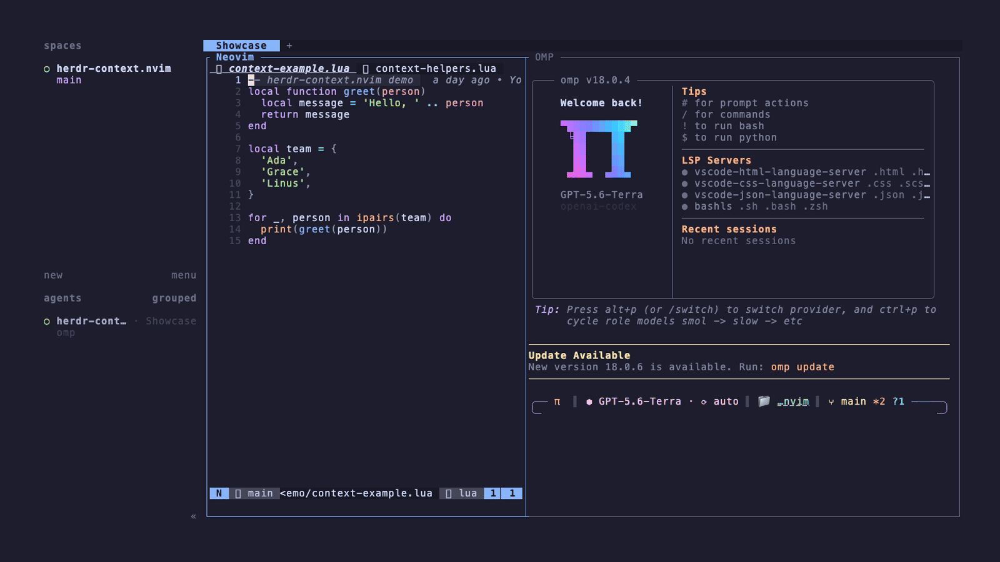
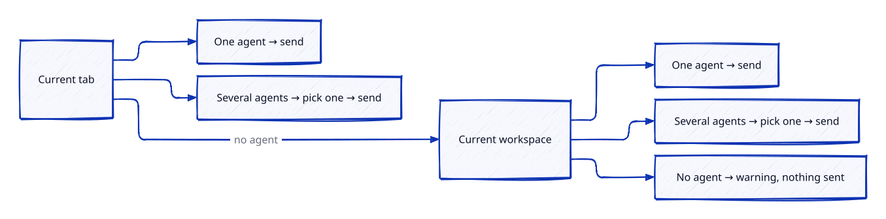

# herdr-context.nvim

<p>
  <a href="https://github.com/mcuste/herdr-context.nvim/actions/workflows/ci.yml"></a>
  <a href="https://neovim.io/"></a>
  <a href="https://herdr.dev/"></a>
  <a href="LICENSE"></a>
</p>



Send the current file, all open files, a visual selection, or the current diagnostics from Neovim to
a coding agent in [Herdr](https://herdr.dev/), a terminal workspace for coding agents. One command
finds the right agent, places the file references in its prompt using the syntax it expects, and
focuses its pane. You can add to or change the prompt before submitting it.

The plugin supports OMP, Pi, Claude Code, and Codex import syntax. It has no Neovim plugin
dependencies and works with any `vim.ui.select` provider.

## How it works


How automated agent picking works:



Picking uses `vim.ui.select`. Tab preference is strict: if the only agent in your tab is blocked, the
plugin refuses it and does not send to another tab.

### What is added to the prompt

The examples below use OMP syntax. Each agent has its own, see [Reference formats](#reference-formats).

Current file:

```text
 @lua/plugin.lua
```

All open files:

```text
 @README.md
 @lua/plugin.lua
```

Whole lines selected in Visual mode:

```text
 @lua/plugin.lua#L18-19
```

Part of a line, or a block selection. Line numbers cannot describe the exact characters, so the
selected text comes with it:

````text
 @lua/plugin.lua#L18-19

```lua
local value = build()
return value
```
````

Current file and its diagnostics. A diagnostic already names the file and its lines, so no separate
file reference is placed:

```text
 @lua/plugin.lua#L18-19 ERROR undefined global `value` [lua_ls undefined-global]
 @lua/plugin.lua#L31-31 WARN unused variable [lua_ls]
```

A Visual selection and its diagnostics. Only the diagnostics in the selected lines are placed:

```text
 @lua/plugin.lua#L18-19 ERROR undefined global `value` [lua_ls undefined-global]
```

All open files and their diagnostics. A file without a diagnostic keeps its plain reference:

```text
 @README.md#L1-1 ERROR first line must be a heading [markdownlint MD041]
 @lua/plugin.lua#L18-19 WARN unused variable [lua_ls]
 @docs/behavior.md
```

Three rules cover the rest:

- Save first. A reference points at the file on disk. The plugin refuses or skips a modified buffer.
  A partial-line or block selection is the exception, because it sends the text itself. Diagnostics
  always need a saved file.
- Paths are shortened. An agent working in `/work/project` gets `@lua/plugin.lua`, not
  `@/work/project/lua/plugin.lua`. A file outside the agent's directory keeps its full path.
- Nothing else is added, and the prompt is never submitted.

[Behavior and routing](docs/behavior.md) has the exact rules for every operation.

## Requirements

- Neovim 0.10 or later
- Herdr 0.7.5 or later
- Neovim running inside a Herdr pane
- A current buffer backed by a file on disk

Run `:checkhealth herdr-context` after installation to check the first three requirements.

## Install

### [lazy.nvim](https://github.com/folke/lazy.nvim)

```lua
{
  'mcuste/herdr-context.nvim',
  opts = {
    mappings = {
      buffer = '<leader>aa',
      buffers = '<leader>aA',
      diagnostics = '<leader>ad',
      buffers_diagnostics = '<leader>aD',
    },
  },
}
```

### [MiniMax](https://nvim-mini.org/MiniMax/)

Add the matching block below the `add` and `later` helpers in MiniMax's `plugin/40_plugins.lua`.

Neovim 0.12 or later:

```lua
later(function()
  add({ 'https://github.com/mcuste/herdr-context.nvim' })
  require('herdr-context').setup({
    mappings = {
      buffer = '<leader>aa',
      buffers = '<leader>aA',
      diagnostics = '<leader>ad',
      buffers_diagnostics = '<leader>aD',
    },
  })
end)
```

Neovim 0.10 or 0.11:

```lua
later(function()
  add('mcuste/herdr-context.nvim')
  require('herdr-context').setup({
    mappings = {
      buffer = '<leader>aa',
      buffers = '<leader>aA',
      diagnostics = '<leader>ad',
      buffers_diagnostics = '<leader>aD',
    },
  })
end)
```

The `buffer`, `buffers`, `diagnostics`, and `buffers_diagnostics` mappings apply in both Normal and
Visual mode. Give each mapping its own keys. No mappings are created unless you configure them.

## Commands

| Command                               | Mode           | Action                                                                 |
| ------------------------------------- | -------------- | ---------------------------------------------------------------------- |
| `:HerdrContextSendBuffer`             | Normal, Visual | Place a reference to the current file or selected range                |
| `:HerdrContextSendBuffers`            | Normal, Visual | Place a reference to every open file                                   |
| `:HerdrContextSendDiagnostics`        | Normal, Visual | Place a reference to every diagnostic in the current file or selection |
| `:HerdrContextSendBuffersDiagnostics` | Normal, Visual | Place a reference to every diagnostic in the open files                |
| `:checkhealth herdr-context`          | Any            | Check Neovim, Herdr, and the current Herdr environment                 |

The buffer command accepts the Ex range that Neovim creates after a Visual-mode selection.

## Reference formats

The selected agent determines the reference syntax.

For `lua/plugin.lua` and lines 18 through 42:

| Agent              | Whole file        | Selected lines                 |
| ------------------ | ----------------- | ------------------------------ |
| OMP                | `@lua/plugin.lua` | `@lua/plugin.lua#L18-42`       |
| Pi                 | `@lua/plugin.lua` | `@lua/plugin.lua#L18-42`       |
| Claude Code        | `@lua/plugin.lua` | `@lua/plugin.lua#18-42`        |
| Codex              | `lua/plugin.lua`  | `lua/plugin.lua Lines 18-42.`  |
| Unknown agent type | `@lua/plugin.lua` | `@lua/plugin.lua Lines 18-42.` |

Diagnostics append severity, a one-line message, and reporting source and code when present:

```text
OMP / Pi:      @lua/plugin.lua#L18-42 ERROR undefined global `value` [lua_ls undefined-global]
Claude Code:   @lua/plugin.lua#18-42 ERROR undefined global `value` [lua_ls undefined-global]
Codex:         lua/plugin.lua Lines 18-42. ERROR undefined global `value` [lua_ls undefined-global]
Unknown agent: @lua/plugin.lua Lines 18-42. ERROR undefined global `value` [lua_ls undefined-global]
```

## Picker

Neovim supplies the default `vim.ui.select` picker. A UI plugin can replace it.
herdr-context.nvim does not depend on Telescope, mini.pick, snacks.nvim, or another picker.

Each picker row starts with a stable `[n]` match key, followed by the Herdr status marker, harness,
tab, optional pane title, and working directory:

```text
[2] ○  Agent: codex  Tab: API  Title: Fix routing  CWD: /work/project
```

Selecting a blocked agent is refused. Cancelling the picker changes nothing.

## Configuration

The complete default configuration is:

```lua
require('herdr-context').setup({
  mappings = {
    buffer = '',
    buffers = '',
    diagnostics = '',
    buffers_diagnostics = '',
  },
})
```

| Option                         | Mode           | Default  | Purpose                           |
| ------------------------------ | -------------- | -------- | --------------------------------- |
| `mappings.buffer`              | Normal, Visual | Disabled | Call `send_buffer()`              |
| `mappings.buffers`             | Normal, Visual | Disabled | Call `send_buffers()`             |
| `mappings.diagnostics`         | Normal, Visual | Disabled | Call `send_diagnostics()`         |
| `mappings.buffers_diagnostics` | Normal, Visual | Disabled | Call `send_buffers_diagnostics()` |

An empty string disables that mapping. Setup always creates all four user commands.

## Lua API

```lua
local herdr_context = require('herdr-context')

herdr_context.setup({
  mappings = {
    buffer = '<leader>aa',
    buffers = '<leader>aA',
  },
})

herdr_context.send_buffer()
herdr_context.send_buffers()
herdr_context.send_diagnostics()
herdr_context.send_buffers_diagnostics()
```

| Function                     | Action                                                                  |
| ---------------------------- | ----------------------------------------------------------------------- |
| `setup(config)`              | Validate configuration, create commands, and create configured mappings |
| `send_buffer()`              | Place a reference to the current saved file or Visual selection         |
| `send_buffers()`             | Place a reference to every open saved file                              |
| `send_diagnostics()`         | Place a reference to every diagnostic in the current file or selection  |
| `send_buffers_diagnostics()` | Place a reference to every diagnostic in the open files                 |

## Failure behavior

The plugin stops before each dependent action when something fails:

| Failure                                                        | Result                                                                  |
| -------------------------------------------------------------- | ----------------------------------------------------------------------- |
| Missing file, unsaved whole-file input, or unsaved whole lines | No Herdr command runs                                                   |
| No open buffer saved on disk                                   | No Herdr command runs                                                   |
| No diagnostic in the current file, selection, or open files    | No Herdr command runs                                                   |
| Missing Herdr environment or failed agent list                 | No text is placed                                                       |
| Failed tab list or cancelled picker                            | No text is placed                                                       |
| Invalid or blocked target                                      | No text is placed                                                       |
| Failed `pane send-text`                                        | The target is not focused                                               |
| Failed `agent focus`                                           | The text remains in the target input and Neovim reports the focus error |

The plugin does not write buffers, start agents, or press Enter in an agent pane.

## Health and troubleshooting

Run:

```vim
:checkhealth herdr-context
```

The check reports:

- the Neovim version
- the Herdr executable and version
- `HERDR_WORKSPACE_ID` and `HERDR_TAB_ID`
- whether Herdr accepts the agent and tab list commands

If the environment variables are missing, start Neovim from a Herdr pane. If the commands do not
exist, make sure your plugin manager called `setup()`. Neovim reports delivery and focus failures
through `vim.notify`.

## Documentation

- [Behavior and routing](docs/behavior.md)
- [Development and release](docs/development.md)
- [`:help herdr-context`](doc/herdr-context.txt)
- [Changelog](CHANGELOG.md)

## Development

```sh
just verify
```

This checks formatting and runs the deterministic and end-to-end test suites. See
[Development and release](docs/development.md) for the repository layout, local testing, CI, and
release process.

## License

[MIT](LICENSE)
