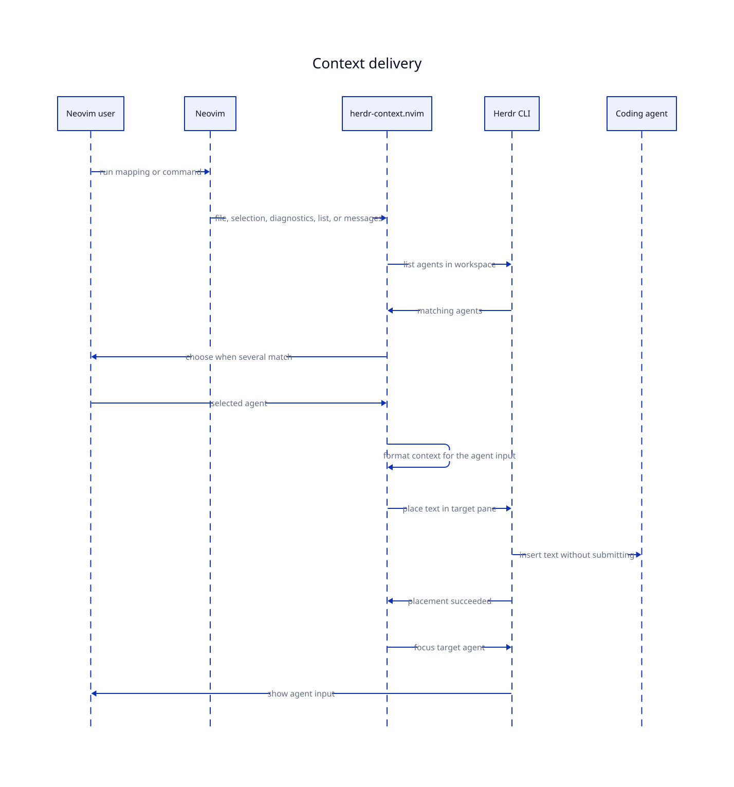

# Behavior and routing

This document describes exactly what herdr-context.nvim reads, which agent it chooses, what text it
places, and where each operation stops on failure.



## Editor input

Every operation requires a normal file buffer with a path that already exists on disk. The plugin
normalizes the path before it calls Herdr.

### Whole file

`send_buffer()` uses the current file as it exists on disk. It refuses a modified buffer because a
path reference would point the agent at older content.

### All open files

`send_buffers()` uses every listed buffer that is saved on disk, in buffer order. This includes
buffers that Neovim has not loaded yet, for example files from the command line or a restored
session. It skips a buffer that has unsaved changes, has no file, or is not a normal file buffer,
and warns how many buffers it skipped. It stops when no buffer remains.

The current buffer is the only one that can carry a selection. `send_buffers()` reads the selection
when it runs in Visual mode or with an Ex range, and then applies the selection rules below to that
file. It stops and reports the reason when the selection itself is invalid, for example whole lines
in a modified buffer. Without a selection, the current file sends a whole-file reference like the
others.

### Diagnostics

`send_diagnostics()` places one line for each diagnostic. It reads them with `vim.diagnostic.get()`,
so every source that publishes into Neovim counts.

- Each line is a complete ranged reference. No file reference is placed, and a partial or block
  selection does not add its fenced text.
- A selection keeps only the diagnostics whose lines overlap it.
- Unsaved changes are refused, because a line reference must match the file on disk.
- No diagnostic stops the operation.
- Lines are sorted by line, then severity, then message, so the same buffer always sends the same
  text.

### All open files with diagnostics

`send_buffers_diagnostics()` uses the buffer list of `send_buffers()`. It places the diagnostics of
each file in buffer order. A file with no diagnostic keeps its plain reference, so the file list
stays complete. A selection in the current buffer limits that file to the selected lines. The
operation stops when no open file has a diagnostic.

### Visual selection

`send_buffer()` reads characterwise, linewise, and blockwise selections with Neovim's `getregion()`
function. The line range is inclusive.

The selected shape decides what is placed:

| Selection | Text placed | Modified buffer |
| --- | --- | --- |
| Complete lines | Ranged file reference | Refused |
| Part of one or more lines | Ranged file reference and exact selected text | Allowed |
| Block selection | Ranged file reference and exact rectangular text | Allowed |

A partial or block selection is appended as a fenced code block. The buffer filetype becomes the
fence language. If the selected text contains backticks, the plugin uses a longer fence so the
selection cannot close it.

For example:

````text
 @lua/plugin.lua#L18-20 

```lua
local value = build()
return value
```
````

The file must still exist on disk when a partial selection comes from a modified buffer. The path
provides location and the fenced block provides the current text.

When `send_buffer()` receives an Ex range, it uses Neovim's most recent `'<` and `'>` marks. This is
how `:'<,'>HerdrContextSendBuffer` works after leaving Visual mode.

## Herdr location

The plugin reads two variables set by Herdr:

| Variable | Purpose |
| --- | --- |
| `HERDR_WORKSPACE_ID` | Limit candidates to the current workspace |
| `HERDR_TAB_ID` | Prefer candidates in the current tab |

A missing or empty value stops the operation before the agent list command.

## Agent routing

The routing rules run in this order:

1. Run `herdr agent list`.
2. Keep valid records whose `workspace_id` matches `HERDR_WORKSPACE_ID`.
3. Use matching records whose `tab_id` matches `HERDR_TAB_ID` when any exist.
4. Use every matching workspace record when the current tab has no agent.
5. Select the only remaining agent without opening a picker.
6. Run `herdr tab list --workspace <workspace-id>` when several agents remain.
7. Open `vim.ui.select` with the remaining agents.
8. Validate the selected target before placing text.

Current-tab preference is strict. If the current tab contains only a blocked agent, the plugin
refuses that target. It does not silently route the input to another tab.

An agent is a valid delivery target only when it has a non-empty pane identifier and is not blocked.
The pane identifier stays internal. It is passed to Herdr for placement and focus.

## Picker behavior

herdr-context.nvim calls the generic `vim.ui.select` API. Neovim supplies a basic implementation,
and UI plugins can replace it. There is no code path for a specific picker.

Candidates follow the order returned by `herdr tab list`, then pane identifier order within each tab.
Each label starts with `[n]` so fuzzy pickers have a stable key to match.

A row can contain:

```text
[2] ○  Agent: codex  Tab: API  Title: Fix routing  CWD: /work/project
```

| Part | Source |
| --- | --- |
| `[2]` | Position in the sorted candidate list |
| `○` | Herdr agent state |
| `Agent` | `name`, `agent`, or `kind`, in that order |
| `Tab` | Tab label, tab number, or tab identifier |
| `Title` | Pane title when Herdr supplies one |
| `CWD` | Foreground working directory, then agent working directory |

The marker reflects the state reported by Herdr:

| Agent state | Marker |
| --- | --- |
| `blocked`, `working`, `done` | `●` |
| `idle` | `○` |
| missing or unknown | `·` |

Cancelling the picker stops the operation. No text is placed and no pane is focused.

## Path selection

The agent's `foreground_cwd` is preferred over its `cwd`. When the current file is below that
directory, the plugin removes the directory prefix and sends a relative path. It keeps the absolute
path when the file is outside the agent directory or when Herdr supplies no working directory.

The prefix check uses path boundaries, so `/work/project/file.lua` is not treated as relative to
`/work/pro`. Windows comparisons ignore path case.

## Reference formats

The agent `kind` selects an adapter. When `kind` is absent, the plugin uses the `agent` field. An
unknown or missing value uses the generic format.

For `lua/plugin.lua`:

| Adapter | Whole file | Lines 18 through 42 |
| --- | --- | --- |
| Amp | ` @lua/plugin.lua ` | ` @lua/plugin.lua Lines 18-42. ` |
| Antigravity | ` @lua/plugin.lua ` | ` @lua/plugin.lua Lines 18-42. ` |
| Claude Code | ` @lua/plugin.lua ` | ` @lua/plugin.lua#18-42 ` |
| Cline | ` @lua/plugin.lua ` | ` @lua/plugin.lua Lines 18-42. ` |
| Codex | ` lua/plugin.lua ` | ` lua/plugin.lua Lines 18-42. ` |
| Copilot CLI | ` @lua/plugin.lua ` | ` @lua/plugin.lua Lines 18-42. ` |
| Cursor | ` @lua/plugin.lua ` | ` @lua/plugin.lua Lines 18-42. ` |
| Devin | ` @lua/plugin.lua ` | ` @lua/plugin.lua Lines 18-42. ` |
| Droid | ` @lua/plugin.lua ` | ` @lua/plugin.lua Lines 18-42. ` |
| Gemini CLI | ` @lua/plugin.lua ` | ` @lua/plugin.lua Lines 18-42. ` |
| Grok CLI | ` @lua/plugin.lua ` | ` @lua/plugin.lua Lines 18-42. ` |
| Hermes | ` @lua/plugin.lua ` | ` @lua/plugin.lua Lines 18-42. ` |
| Kilo Code | ` @lua/plugin.lua ` | ` @lua/plugin.lua#18-42 ` |
| Kimi CLI | ` @lua/plugin.lua ` | ` @lua/plugin.lua Lines 18-42. ` |
| Kiro CLI | ` @lua/plugin.lua ` | ` @lua/plugin.lua Lines 18-42. ` |
| Maki | ` @lua/plugin.lua ` | ` @lua/plugin.lua Lines 18-42. ` |
| Mastra Code | ` @lua/plugin.lua ` | ` @lua/plugin.lua Lines 18-42. ` |
| OMP | ` @lua/plugin.lua ` | ` @lua/plugin.lua#L18-42 ` |
| opencode | ` @lua/plugin.lua ` | ` @lua/plugin.lua#18-42 ` |
| Pi | ` @lua/plugin.lua ` | ` @lua/plugin.lua#L18-42 ` |
| Qoder CLI | ` @lua/plugin.lua ` | ` @lua/plugin.lua Lines 18-42. ` |
| Qwen Code | ` @lua/plugin.lua ` | ` @lua/plugin.lua Lines 18-42. ` |
| Generic | ` @lua/plugin.lua ` | ` @lua/plugin.lua Lines 18-42. ` |

Every reference starts and ends with one space. This prevents a new reference from joining text
already present in the agent input. Codex paths that contain spaces are enclosed in double quotes.
Only Claude Code, Kilo Code, OMP, opencode, and Pi have a line range syntax. Every other agent uses
the generic text for a range. Gemini CLI and Qwen Code read a path up to the first space or shell
character, so the plugin escapes those characters with a backslash. Kiro CLI has no `@` syntax, so
its reference stays plain text that the agent reads itself.

Each diagnostic adds its own line:

```text
 @lua/plugin.lua#L18-20 ERROR undefined global `value` [lua_ls undefined-global] 
```

The adapter formats the ranged reference. Then come the `vim.diagnostic.severity` name, the message
joined into one line, and the source and code when Neovim has them.

A range that ends at column 0 stops before that line, so the reference ends on the line above.

Several files are placed as one text. The references use the same adapter and each file starts on
its own line, so selected text stays with its own reference and a fenced code block cannot swallow
the next one:

````text
 @README.md#L3-3 

```markdown
# title
```
 @lua/plugin.lua 
````

## Herdr commands

The plugin starts Herdr with argument arrays through `vim.system`. It does not build shell command
strings.

A single-agent operation runs:

1. `herdr agent list`
2. `herdr pane send-text <pane-id> <text>`
3. `herdr agent focus <pane-id>`

A multiple-agent operation adds this command before the picker:

```text
herdr tab list --workspace <workspace-id>
```

Focus runs only after text placement succeeds. The plugin uses `pane send-text`, not a command that
submits the prompt.

## Failure behavior

| Failure point | Notification level | Later actions |
| --- | --- | --- |
| Invalid buffer, missing file, or disallowed unsaved changes | Warning | No Herdr command |
| No open buffer saved on disk | Warning | No Herdr command |
| No diagnostic in the buffer, the selection, or the open files | Warning | No Herdr command |
| Invalid selection in the current buffer | Warning | No Herdr command |
| Missing workspace or tab environment | Error | No Herdr command |
| Agent list failure or invalid response | Error | No routing, placement, or focus |
| No agent in the current workspace | Warning | No placement or focus |
| Tab list failure or invalid response | Error | No picker, placement, or focus |
| Picker cancellation | None | No placement or focus |
| Invalid selected target | Error | No placement or focus |
| Blocked selected target | Warning | No placement or focus |
| Text placement failure | Error | No focus |
| Focus failure | Error | Placed text remains in the target input |

All messages use `vim.notify` with the title `herdr-context.nvim`.

## Deliberate limits

- The plugin does not save or modify the current buffer.
- The plugin does not send a full file body. It sends a path reference.
- The plugin does not send unlisted, unloaded, or unsaved buffers.
- The plugin includes source text only for partial-line and block selections.
- The plugin does not filter diagnostics by severity and does not run a linter.
- The plugin does not start an agent when the workspace has none.
- The plugin does not submit the target agent's input.
- The plugin does not select a different workspace.
- The plugin does not define a picker UI.
